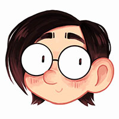

# About Me

Hello! I'm Adela, a freelance digital illustrator currently based in Prague, Czech Republic.

# My Story

I'm a Czech artist that grew up in a tiny village in Moravia, surrounded by beautiful groves and apple orchards. From an early age, I showed a particular interest in drawing. It all started with me creating all kinds of critters that I liked to imagine live in the woods near my family house, where you could often find me sketching and reading books. I developed a great fondness for nature and fantasy elements, which is reflected in my work. It revolves mostly around colourful characters, creatures and environments. 

When I'm not drawing, I like to indulge in my other passions that include a love for storytelling, playing games, wandering the woodlands, petting dogs and napping under trees.

I am always looking for new projects and creative opportunities, so feel free to contact me!
 

