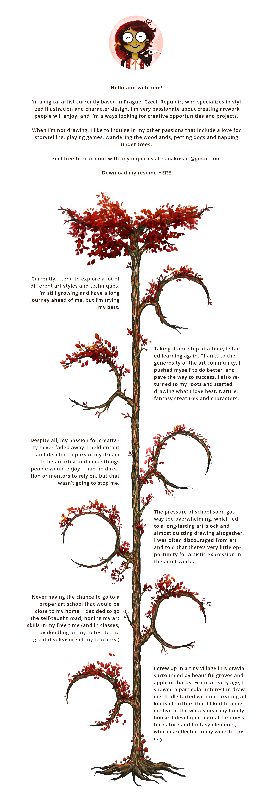

# Storytelling
* "Stories are key to helping people decide if they want to work with you, invest in your project, or refer you to someone else."

#### Initial idea
* The way I wanted to approach this assignment was connecting it to my thesis, which is about self-branding, and creating something that I could use for my own website in the future.
* I came up with the idea of making a sort of short biography timeline that would be in the about section. It would give clients that visit my portfolio the option to learn something more about me beyond a short bio.

#### Brainstorming
Mentioning only moments throughout my life that are relevant to my artistic journey
1. Growing up in a village -> spending time in nature helped my creative thinking, inspired me to draw, and I developed a great fondness for nature and fantasy elements
2. School experience -> hated it, spent time doodling in class and writing stories because I was bored
3. Struggles with art block -> Teachers and people around me were discouraging me from pursuing art as a career, which lead to a long art block
4. Decided to be stubborn and pursue it anyway
5. Started studying art on my own with the help of the online art community
6. Where I'm now 

### [Process](Presentation.pdf)

