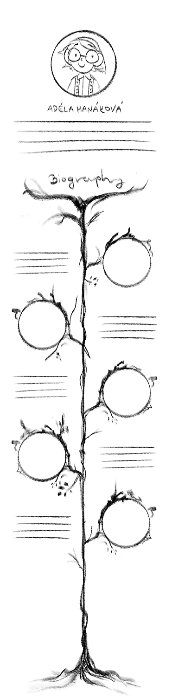

# Storytelling

#### My journey
Mention only moments throughout out my life that are relevant to my artistic journey
1. Growing up in a village -> spending time in nature helped my creative thinking and inspired me to draw, developed a great fondness for nature and fantasy elements
2. School experience -> hated it, spent time doodling in class and writing stories because I was bored
3. Teachers and people around me were discouraging me from pursuing art as a career -> lead to an art block
4. Decided to be stubborn and pursue it anyway

.
