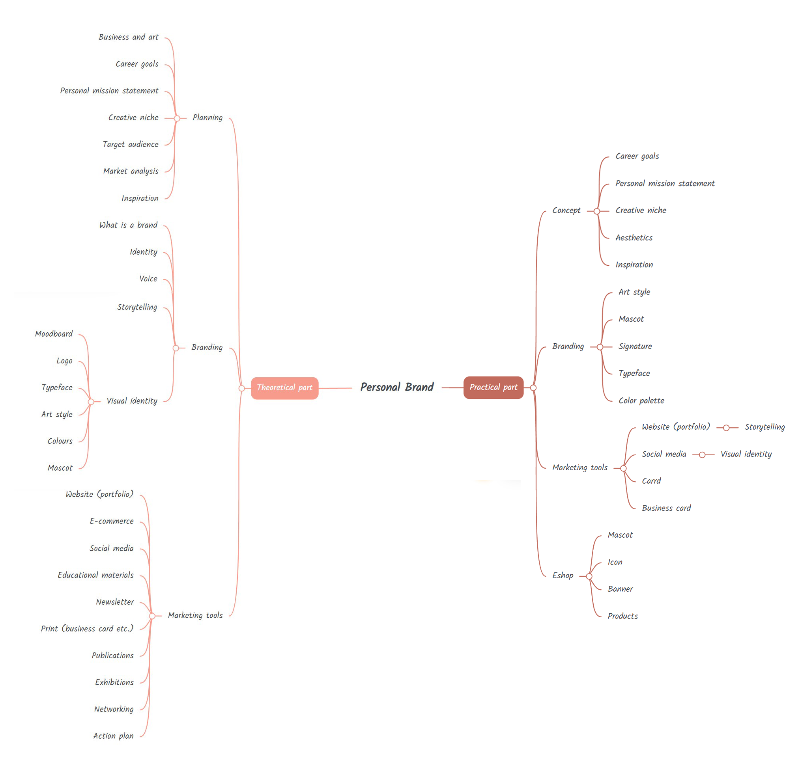

- [Summary](#summary)
- [Mind Map](#mind-map)
- [Keywords](#keywords)
- [Key Points](#key-points)
- [References](#references)
- [Inspiration](#inspiration)
- [Warm-Up](#warm-up)

# Personal Brand

## Summary 💐

My project focuses on the process of creating a personal brand as a graphic designer or an illustrator. A personal brand is a form of marketing that an individual uses to create a unique public image that demonstrates their values. My thesis should inform the reader on which terms to familiarize themselves with, where to start and which tools they can choose from and use to help them with their creative journey. 

## Mindmap 🌷

**Planning**
 - Talking about one of the most important stages in creating your own brand – planning. It contains discussion about how to define your career goals, whether to focus on freelance vs in-house, how to choose your target audience etc. 
 
**Branding**
 - Everything having to do with actual branding
  
**Marketing tools**
 - Focusing on individual marketing tools

## Keywords 🌻

self-branding, self-brand, branding, marketing, advertisement, graphic design, illustration

## Key Points 🌾

<!-- Key points; aim for **30–60 words** each. -->

1. Background/importance of the topic: The topic of self-branding is crucial because it allows us to show our skills and qualities, what we're like as individuals, and it defines what is important to us.
3. Purpose/hypothesis (thesis or statement of the problem): I want to tackle a topic that a lot of schools (including ours) fail to explore and properly teach their students. Artists generally have a problem with self-marketing and thus getting clients and building their career, which is where the stereotype of a poor artist that makes no money comes from. My project should help me and others to learn more about self-marketing and how to make it work for us as artists.
5. Research — design/methodology/approach including procedures/data/observations: I chose several books by professionals that I'll be using mainly for the theoretical part of my thesis. Some of my favourites are What They Don't Teach You in Art School by Will Terry, I'd Rather Be in the Studio!: The Artist's No-Excuse Guide to Self-Promotion by Alyson B. Stanfield, Designing Brand Identity: An Essential Guide for the Whole Branding Team by Alina Wheeler, Find Your Artistic Voice: The Essential Guide to Working Your Creative Magic by Lisa Congdon, and others.
5. Findings (highlight outcome of research): 
6. Conclusions (significance/success of study to theory/practical/society): I hope to finish my own final visual identity and have concise theoretical research about this topic ready for other people and myself.

## References 🌿

<!-- Add reference list. See Reference List Style -->

- …
- …
- …

## Warm-Up 🍃

In class exercise: Explore key points with the PAR method, then write a statement.

1. Problem:
2. Action:
3. Result:

<!-- Put it all together in a statement -->

PAR statement:
